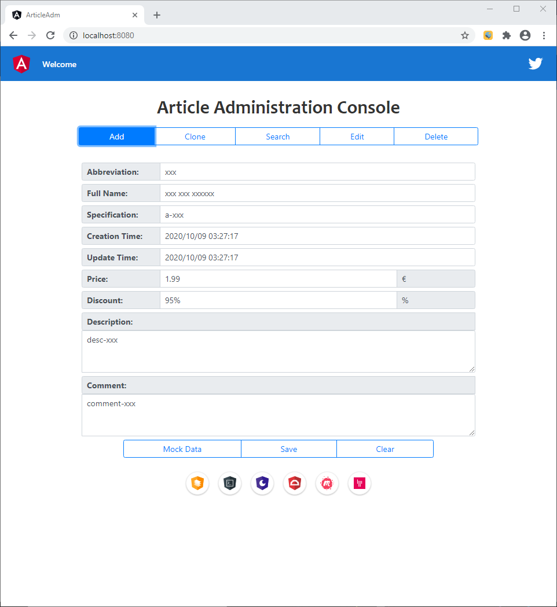
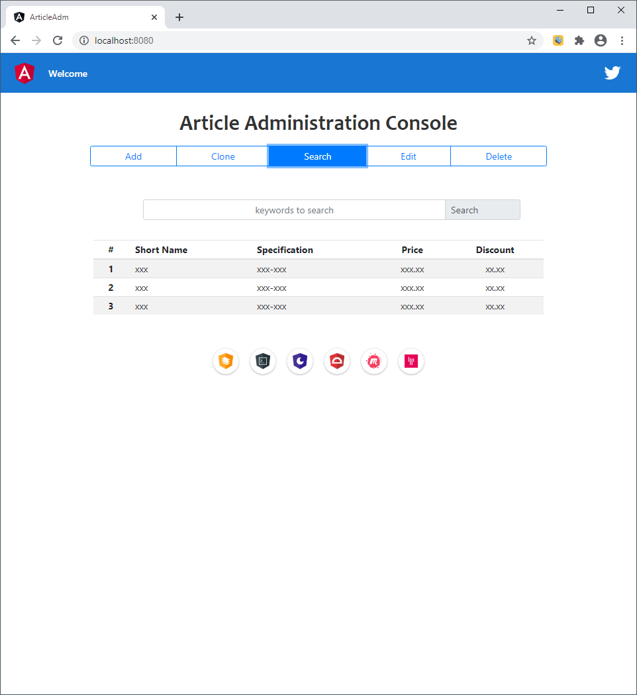
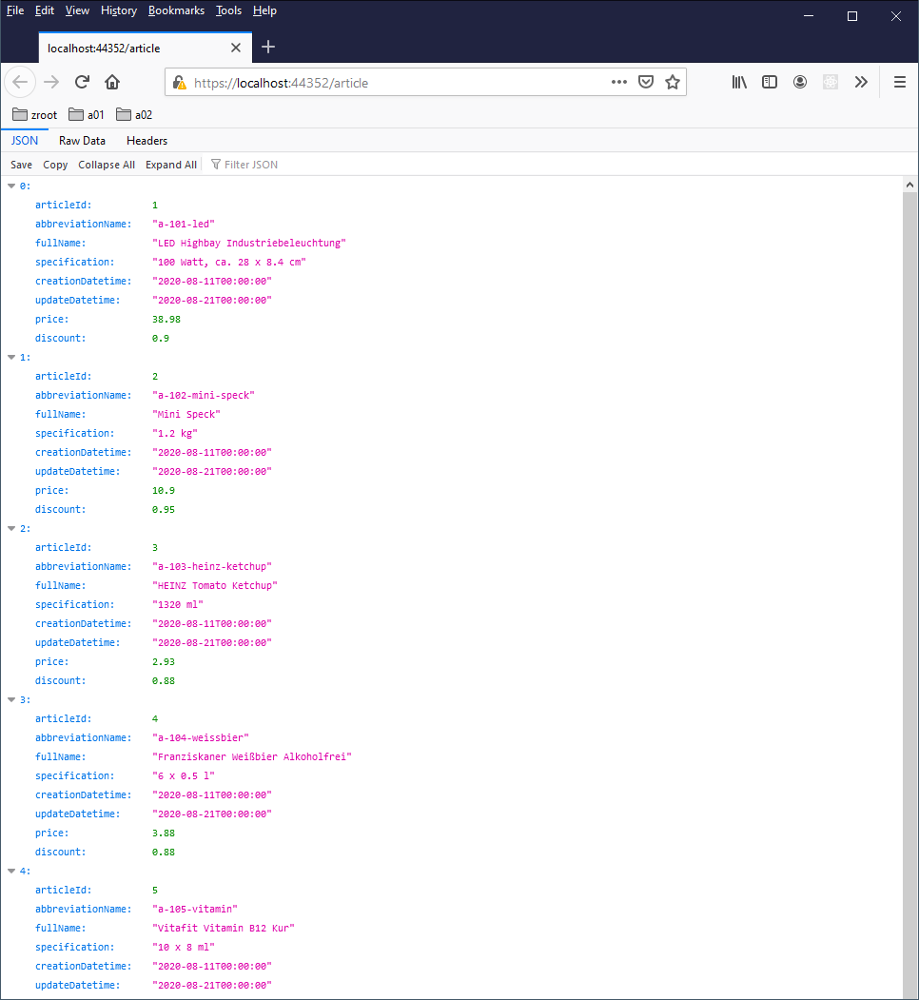

# Online Shop Administration Console

## Frontend

The backend is implemented with Angular 10.

### Related Technologies

* Angular 10
* RESTful APIs
* Bootstrap 4.5

### How to Build

The "node_modules" folder is removed due to its huge size. You may run the following command in the project folder to install those modules.

__Attention__: Please install "node.js" and "npm" in advance.

`npm install`

### How to Run

The back-end server should be started firstly.

In the project folder, execute the following command to run this Angular front-end.

`ng serve`

### Possible Bugs

Both the front-end and the back-end are built in the development mode. If they are built for the production mode, the cross-orgin requests may not work.

## Screenshot

## Backend

The backend is implemented with ASP.NET Core.

### Related Technologies

* ASP.NET Core (C#)
* MVC
* RESTful APIs
* Entity Framework
* SQLite

### Screenshots

